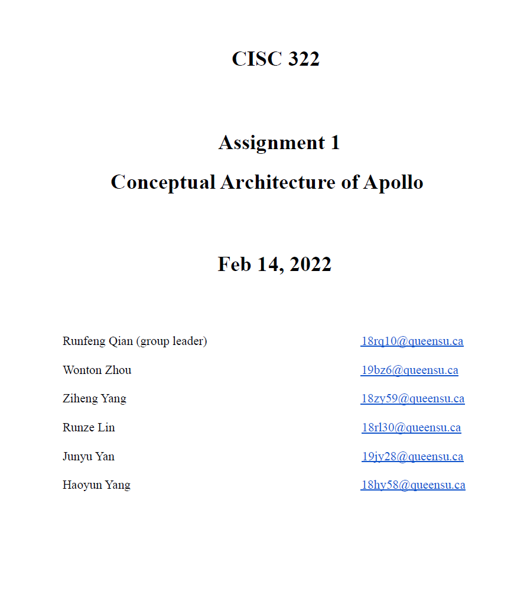
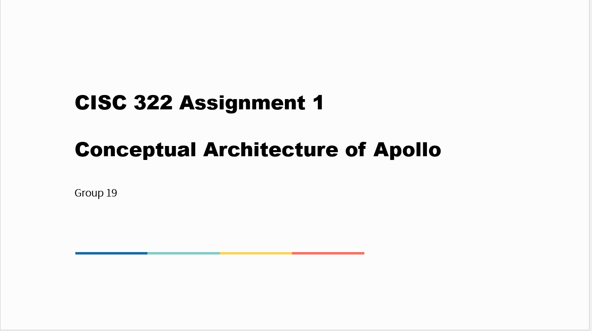

# Overview

This assignment introduces the conceptual architecture of Apollo, an autonomous vehicle system. For this assignment, our group talked about what the system is capable of, what the components of the architecture are, what the interactions between different modules are and user cases with sequence diagrams and descriptions.

# [Assignment 1: Report](./doc/CISC_322_Group_Project_report_A1.pdf)

# [Assignment 1: Presentation](./doc/CISC_322_Group_Project_slide_A1.pdf)

[Back to Homepage](./)
