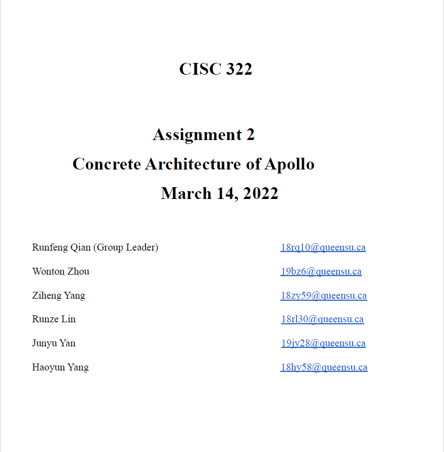
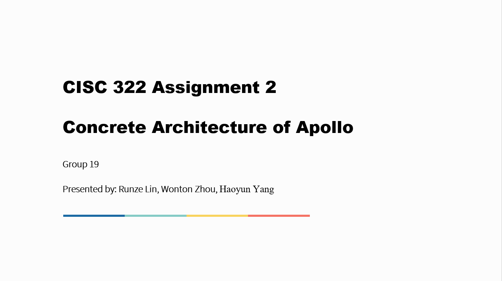

# Overview

This assignment introduces the concrete architecture of Apollo. For this assignment, our group analyzed the concrete architecture of Apollo by using the Understand™️ tool and pub-sub dependencies provided by the professor. Then we compare it with our modified conceptual architecture, and we also provided a new subsystem, finally we discuss 2 use cases using the concrete architecture.

# [Assignment 2: Report](./doc/CISC_322_Group_Project_report_A2.pdf)

# [Assignment 2: Presentation](./doc/CISC_322_Group_Project_slide_A2.pdf)

[Back to Homepage](./)
