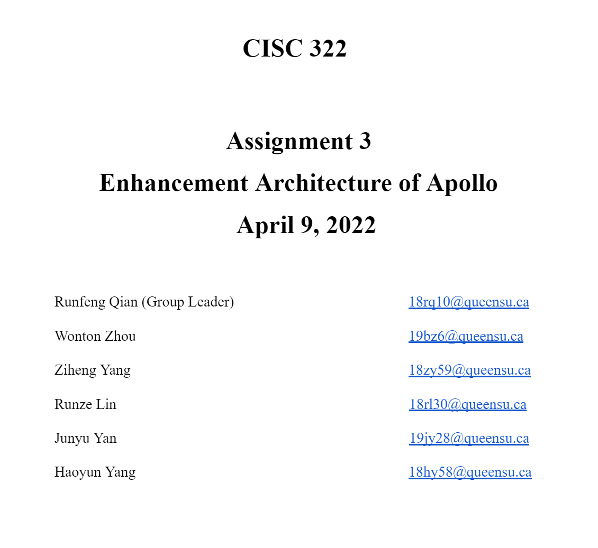
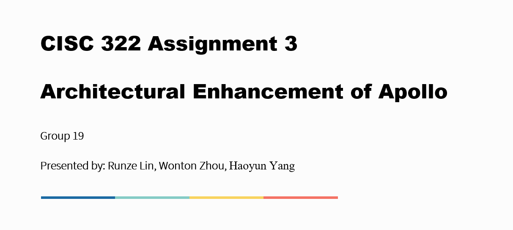

# Overview

This assignment introduces the enhanced architecture of Apollo. For this assignment, our group added some extra features to the Apollo architecture, we used SAAM to analyze the stakeholder and their NFR and choose the best one from 2 approaches. the details are in the report.

# [Assignment 2: Report](./doc/CISC_322_Group_Project_report_A3.pdf)

# [Assignment 2: Presentation](./doc/CISC_322_Group_Project_slide_A3.pdf)

[Back to Homepage](./)
